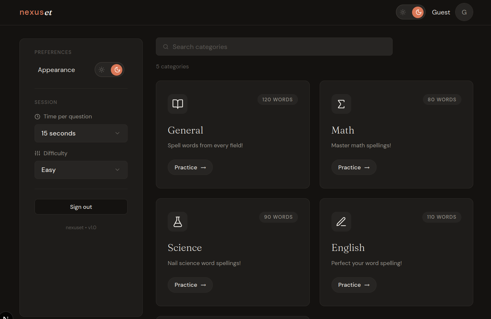
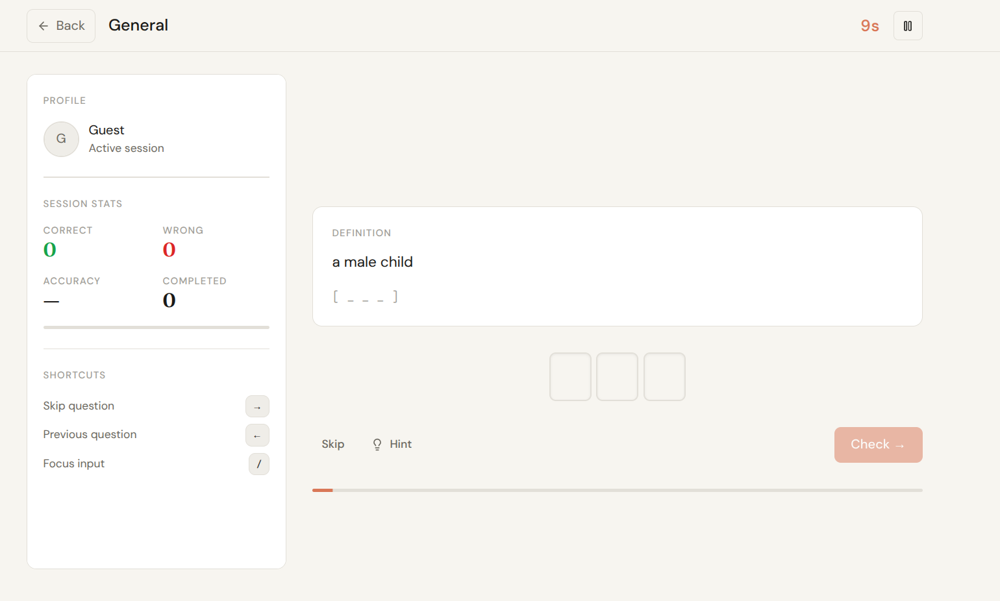
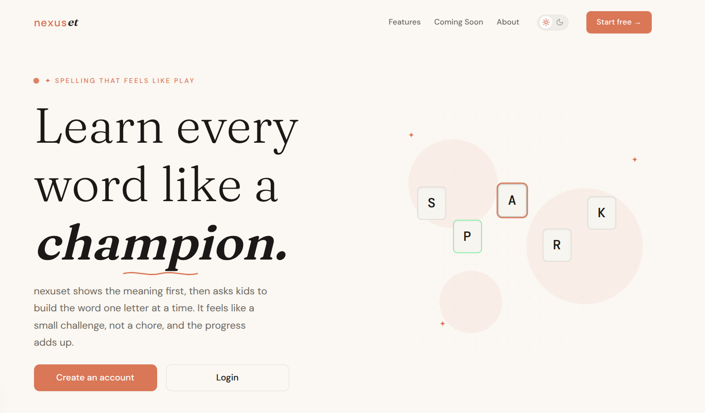
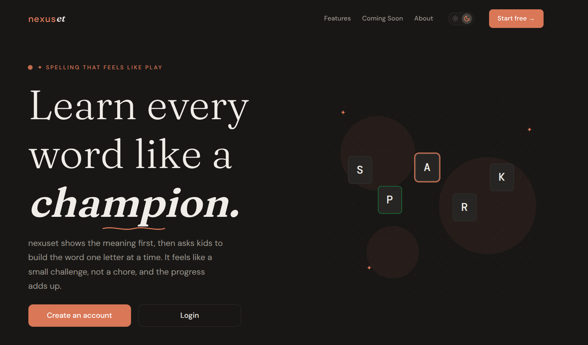

# nexuset

nexuset is a focused spelling practice app for students. It is built to feel calm and structured while still making progress visible. The flow starts with a meaning, then asks the learner to build the word one letter at a time. That small shift makes spelling feel like a game of recall instead of a chore.

## What It Does

- Definition first spelling to build recall
- Support for multiple categories to help with diverse subjects and interests
- Timed sessions for focus and pacing
- Light and dark themes for different study settings

## Visual Notes

Support for multiple categories to help with diverse subjects and interests

Questions with timers and guided pacing

Light and dark mode experiences

## How It Is Used

1. Choose a category like English, Science, or Geography.
2. Read a definition and build the word one letter at a time.
3. Use the timer if you want a faster pace, or turn it off for a calm session.
4. Check progress with session stats and completion feedback.

## Project Structure

- `src/app` App Router pages and UI
- `src/app/components` Landing page sections
- `src/components` Shared UI building blocks
- `src/context` Providers
- `src/lib` Data and service helpers
- `src/stores` Zustand stores
